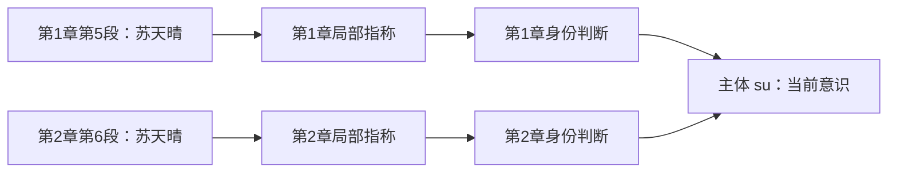

# 用例理解 V7 记录

本说明使用 [两章金标](../t07-v7-schema-gold/dataset-v7.json) 中的真实 ID，便于在查看器或 CLI 中查验；它不是另一份 schema。

## 局部指称与身份判断

主体 Entity 是希望持续跟踪的对象。Mention 是原文某个位置的一段文字，例如第 1 章第 5 段的“苏天晴”。Referent 是这段上下文中，这个词所指的对象；先保留这个局部对象，不凭同名就认定它是谁。Resolution 则记录“这个局部对象归属于哪个主体”的判断、候选或未定状态，并通过论证和评估决定是否采用。

例如这份金标有：

两条链分别为 `ref:su:c1 → resolve:su:c1 → su` 和 `ref:su:c2 → resolve:su:c2 → su`。两个局部指称的显示名都是“苏天晴”，但来源和 ID 不同，并非两个同样的持久主体。点击“记录溯源”时，查看器收集所有归到当前主体的身份判断，所以会同时出现两条来源链。

按章生成局部指称是当前金标构建方式，不是 V7 必须遵守的“一章一个”的规则。一个主体可能有一条、多条或尚未确认的身份链。同一章出现同名的两个人，也不能塞进同一个指称。局部对象保留下来，是为了以后发现误认时，只撤回有关归属及依赖它的解释，而不是到处修改原文引用。

这里的“身份判断”只回答局部词语指向哪个持续对象，不保证这个对象自报的身份为真。例如把原文“造物主”归到 `creator`，只是持续跟踪“秘典提到的那个对象”，并没有证实它真是世界创造者。

查看器目前给局部节点显示相同的名字和类型，没有把章段常驻在图标签上，因此容易看成重复。详情的可见位置和记录 JSON 能确认来源。后续展示可用“苏天晴 · 第1章”和“苏天晴 · 第2章”区分，不需要因此合并底层记录。

## 披露、论证与评估

它们分别回答三个问题：

| 记录 | 回答的问题 | 解决的问题 |
| --- | --- | --- |
| Disclosure 披露 | 原文通过谁、以何种方式提供了什么内容？ | 保存台词、心理活动、叙述等来源，避免把所有文本都当世界事实 |
| Argument 论证 | 为什么这些材料支持、反对或质疑这个结论？ | 保留所用前提、身份映射、假设和推理方法，能复核或撤回具体依据 |
| Assessment 评估 | 综合当前可用论证，这个结论应怎样看待？ | 汇总支持与反对，区分已采纳、待定、有争议、无支撑；依据变化时重新评估 |

原文第 1 章第 63 至 66 段，秘典说明契约身份，并称造物主定制了任务。金标中的实际链为：

1. `d119` 披露：秘典说了这些话，渠道为 speech，有原文章段。
2. `f119` 命题：把这次发言表达成可查询结构，保留说话者 book、接受者 su、身份及 taskAuthor；`assertion.kind` 为 speech。
3. `arg:f119` 论证：用 d119 支持 f119，特别注明“造物主身份和任务来源仅为秘典说法”。
4. `assess:f119` 评估：这条发言命题有可用依据，所以 accepted。被采纳的是“秘典有此说法”，不是将台词内容认证为世界真相。
5. `access:su:f119` 认知记录：苏天晴 heard 这条说法。因此可以回答“她听闻过造物主相关说法”，不能扩大为“她认识造物主”或“她知道造物主的真实身份”。

这三类记录不要求总是一对一。多个披露可以共同支持一条论证，同一命题可以有独立支持与反对论证，评估再汇总它们。当前两章的许多直接表述采用短链，是手工金标的选择；后续真实 ingest 要检验记录粒度是否值得其维护和查询成本。

## 查询时的判断

检索到 Fact 后同时看 assertion、当前 assessment、故事时间和 provenance。需要解释再展开论证，需要核对措辞再取原文。摘要是入口，不是独立的新证据。查询不到只能说明当前范围和检索条件没有命中；两章金标属于重要语义选取，不能证明原作不存在某条知识。
