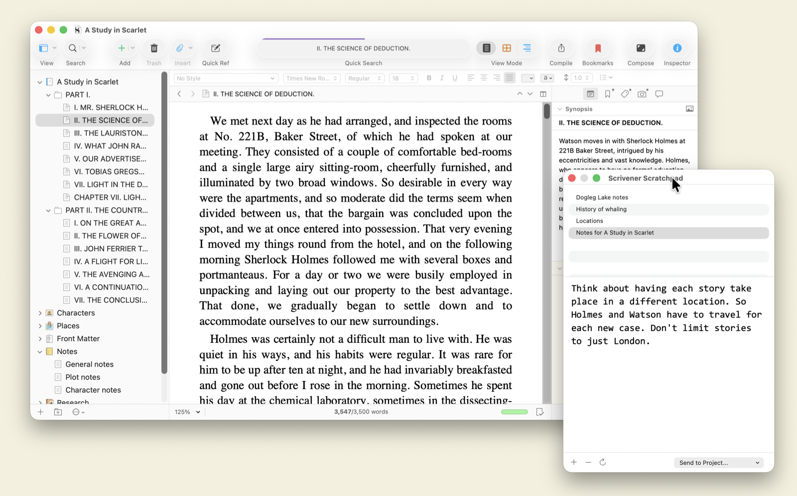
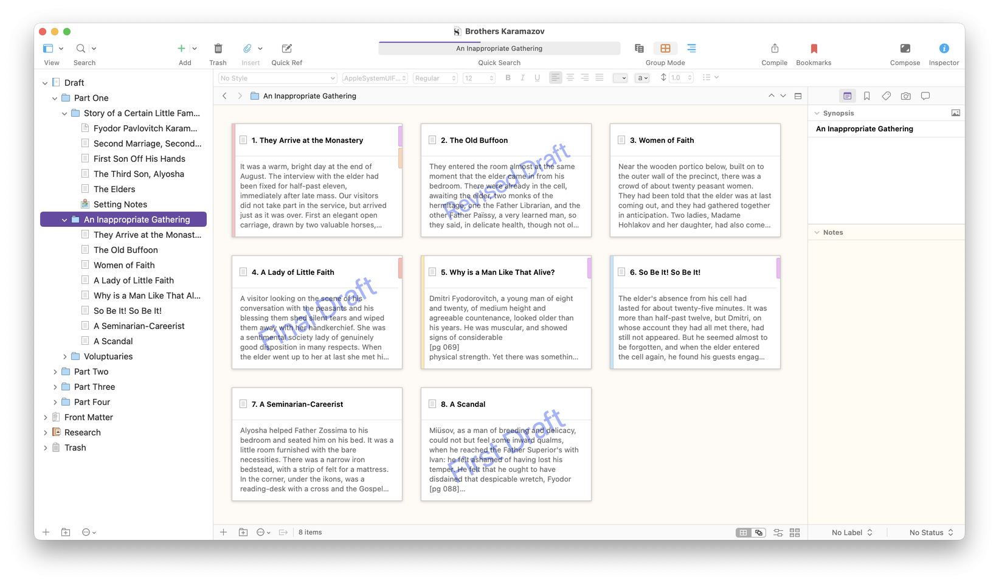
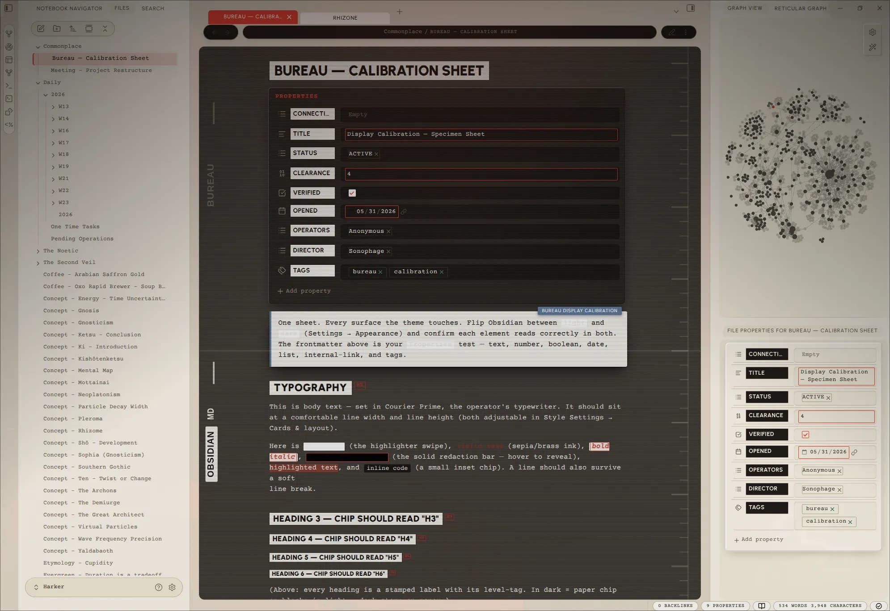
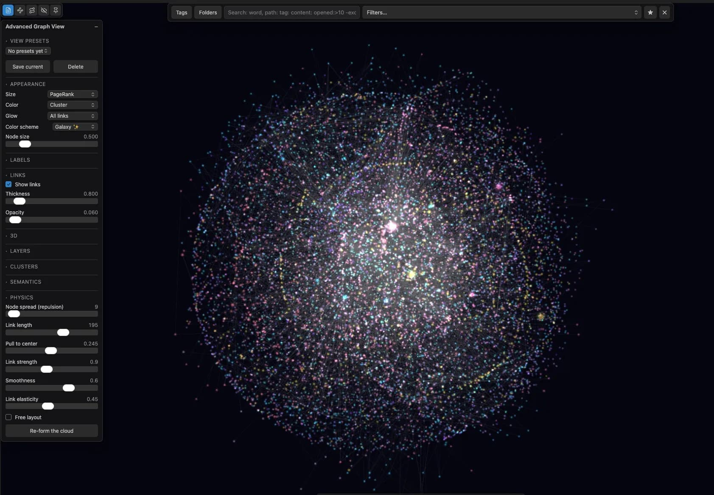
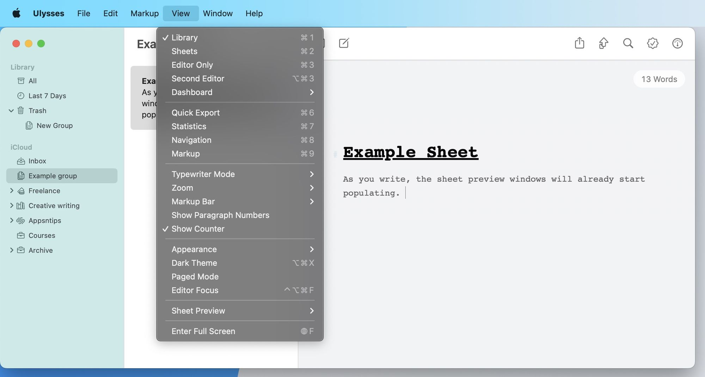
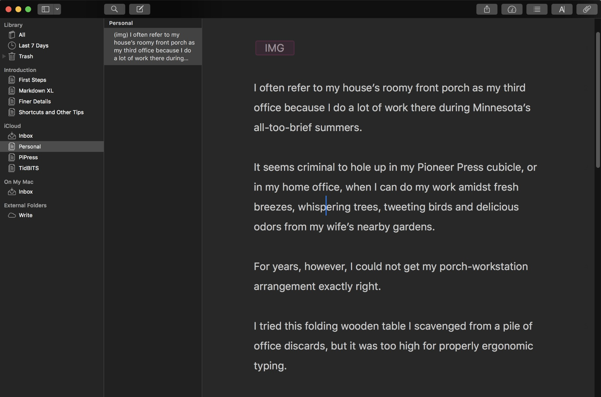
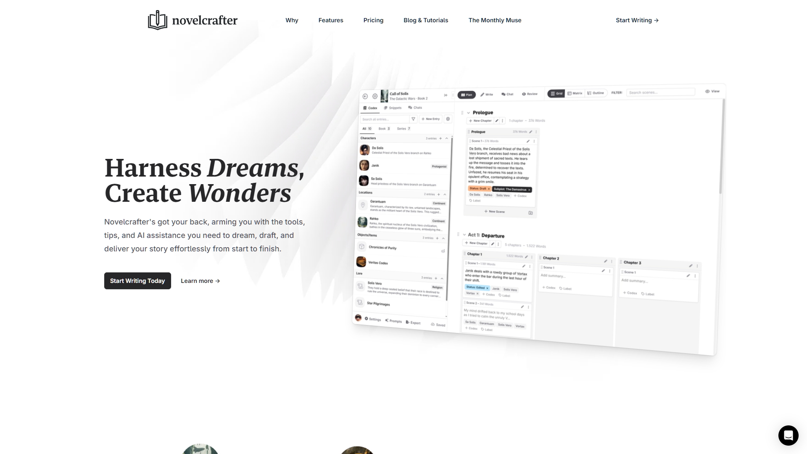

# 竞品 IA 调研（任务007 产出）

> 生成：2026-09-20，工程队常驻窗口。方法：图片搜索获取官方素材/社区实拍图（来源与原尺寸见各图注），功能事实经 WebSearch 核对官方文档与评测（来源见文末）。
> **重要局限**：本机代理节点当前不可用（实测 Scrivener/Obsidian/Ulysses 官网直连、走本机代理均连接被关闭；百度正常、GitHub 被墙同症），**无法实时打开官网截图**，故截图为官方素材图/权威评测实拍图，**非 1920×1080 统一视口**。已登记任务书疑问区，前线可决定是否在代理恢复后补拍。文本结论不受影响。

## 一、Scrivener（Literature & Latte）

*官方素材图 1600×997：Binder 树 + 编辑器 + Synopsis/Inspector，底部 Project Targets（3,547/3,500 字），右下 Scratchpad 便签*

*官方素材图 1643×962：手稿在软木板上的索引卡视图（含"First Draft"水印）*

- **导航层级**：单窗口三栏。一级导航 = Binder（项目树）；顶部工具栏在 编辑器/Corkboard（软木板）/Outliner（大纲）三种视图间切换，三者是**同一数据的三个视图**。层级：项目 → 文件夹 → 文档，通常 2-4 层。
- **项目/文件组织模型**：Binder 树固定三大根——Manuscript（稿件）、Research（研究资料）、Templates（模板）；文件夹与文档统一模型（文件夹自身也可有正文）；全部可自由拖拽重组。
- **编辑器与元数据**：右侧 Inspector 常驻面板挂接 synopsis、笔记、关键词、自定义元数据、书签、批注、快照；Corkboard 的每张索引卡 = 一篇文档的 synopsis 卡；元数据在 Corkboard/Outliner/Inspector 三处同源可编辑。角色/地点档案放 Research 下作为普通文档（用模板新建），通过拖拽和引用与稿件关联——关联是"弱链接"。
- **长文特有功能**：Snapshots 版本快照（保存/对比/回滚）；Project Targets 字数目标（截图中 3,547/3,500 进度条）；**Compile 编译引擎**——内容与排版分离，一键组装成 Word/PDF/EPUB 交付稿。

## 二、Obsidian

*社区实拍图 1991×1368：左文件导航器 + 中编辑器（properties 属性面板 + 正文）+ 右侧图谱与文件属性*

*社区实拍图 1683×1169：图谱视图与过滤设置面板*

- **导航层级**：左侧固定 ribbon 图标条（一级），文件浏览器/搜索/标签等面板二级切换；右侧反链/大纲/属性面板。层级浅，靠链接补深度。
- **项目/文件组织模型**：vault = 本地文件夹（纯 Markdown 文件，"file over app"）；组织靠**文件夹 + 双向链接 [[wikilink]] + 标签**三种机制并存，官方与社区主流做法是浅文件夹、重链接；图谱视图可视化全库链接结构。
- **编辑器与元数据**：YAML frontmatter 已升级为原生 properties 面板（截图中 TITLE/STATUS/TAGS 等字段）；角色档案 = 普通笔记，经链接挂进任何正文；Bases/社区插件提供数据库式视图。元数据与正文的耦合度全靠用户自建约定——自由但无内建长文语义。
- **长文特有功能**：**无原生编译/交付链**——长文组装靠 Longform/Pandoc 等社区插件；Canvas 白板用于大纲拼稿（常见工作流：原子笔记 → Canvas 排结构 → 汇总成长文）；版本靠 Git 插件或文件恢复；字数目标需插件。Obsidian 官方不预设"写书"工作流，把它交给插件生态。

## 三、Ulysses

*评测实拍图 2000×1071：Library 侧栏（All/Last 7 Days/Trash/iCloud 分组）+ 表列表 + 编辑器，View 菜单展示 Library/Sheets/Editor Only 分栏开关*

*评测实拍图 1828×1208：暗色主题下侧栏 + 编辑器*

- **导航层级**：固定三栏（Library 侧栏 → Sheet 列表 → 编辑器），View 菜单可收起为 Sheets Only / Editor Only。层级：Library（iCloud）→ Group（组，可嵌套）→ Sheet（写作片段）。
- **项目/文件组织模型**：**Group/Sheet 模型**——书=Group，场景/章节片段=Sheet（刻意做短）；Filter 智能文件夹按关键词/元数据自动收集散落文本；全部存 iCloud 云端库，本地无文件树。
- **编辑器与元数据**：附件栏（图片/备注/关键词）挂接 sheet 或 group；写作目标（goal）可挂在 group 或 sheet 上并可视化进度；批注与高亮内联。
- **长文特有功能**：Statistics 全局统计 + 写作历史曲线；内置版本历史（自动快照、时间线回滚）；**发布即导出**——直接推 WordPress/Medium/Ghost/邮件/PDF/DOCX，导出预设（样式主题）替代 Scrivener 的 Compile。

## 四、Novelcrafter（补充竞品）

*官网落地页整页截图 1920×1080：顶部 Plan/Write/Chat/Review 工作流切换，左侧 Codex 侧栏（Characters/Locations/Items/Lore），主区 Grid 场景矩阵*

- **导航层级**：顶部一级工作流 Tab——**Plan / Write / Chat / Review**（先规划后写作的心智模型直接做成 IA）；视图切换 Grid/Matrix/Outline；左侧常驻 Codex 侧栏。层级：Series → Book → Chapter → Scene 四层，**Scene 是最小写作单元**。
- **项目/文件组织模型**：场景卡片矩阵（Grid），每张卡带 summary、状态标签、Codex 链接；拖拽重排章节场景。
- **编辑器与元数据**：**Codex 是核心创新**——角色/地点/物品/Lore 的 wiki 条目直接链接到场景，写作时上下文自动可用，**AI 提示只注入当前场景关联的 Codex 条目**；条目带别名、关系。
- **长文特有功能**：场景级字数与状态跟踪；AI 辅助（bring-your-own-key，OpenAI/Claude 等）；导出交付稿。它是四家里唯一把"AI 上下文管理"做成一级 IA 的。

## 五、对比表（竞品 × IA 要素）

| IA 要素 | Scrivener | Obsidian | Ulysses | Novelcrafter |
|---|---|---|---|---|
| 一级导航 | Binder 项目树 | ribbon + 面板切换 | Library 三栏固定 | 工作流 Tab（Plan/Write/Chat/Review） |
| 组织主模型 | 树（文件夹=文档） | 文件夹+双链+标签 | Group/Sheet + Filter | Series/Book/Chapter/Scene 四层 |
| 最小写作单元 | 文档（可任意长） | 笔记（原子化） | Sheet（刻意短） | Scene（场景） |
| 元数据挂接 | Inspector 常驻面板 | YAML properties 面板 | 附件栏 + goal | Codex wiki 链接到场景 |
| 元数据视图 | Corkboard 卡片/Outliner 表格 | 图谱/数据库插件 | Sheet 列表 | Grid 矩阵卡片 |
| 版本/快照 | Snapshots 内建 | Git 插件/文件恢复 | 内置版本历史 | —（未作为核心） |
| 字数目标 | Project Targets | 插件 | goal 挂 group/sheet | 场景级跟踪 |
| 交付/导出 | Compile 编译引擎 | 插件（Pandoc/Longform） | 直接发布到平台 | 导出 |
| AI 上下文 | 无原生 | 无原生 | 无原生 | Codex→场景按需注入 |

## 六、对 NeuroBook 的启示（纯建议，不实施）

1. **"结构总览"必须是一级公民且可寻址**。四家都把全局结构视图（Binder/图谱/Library/Grid）放在导航第一层；对照任务006 模块地图：NeuroBook 真实业务路由只有 4 个，IDE/plot/world-engine 全塞在 `/` 下组件切换，无 URL、无深链、无回退。IA 重构第一刀应是**每个工作台一个路由**（如 `/plot`、`/world-engine`、`/agent`）。
2. **元数据用常驻面板，不用巨型对话框**。Scrivener Inspector、Obsidian properties、Novelcrafter Codex 侧栏全是同屏常驻；NeuroBook 的 `NovelIdeSettingsDialog.vue`（1,333 行）与多个 Dialog 型组件（任务006 Top 表中大量 `*Dialog.vue`）应考虑改为侧栏/面板模式，与编辑器同屏。
3. **选一个组织主模型并贯彻**。四家各自极端自律（Scrivener 一棵树到底、Ulysses 两层到底）；NeuroBook 目前 plot 有 tree/timeline/thread/workbench 四种视图组件平铺（`plot.preview` 等 5 个预览路由），重构时需要明确"书→卷→章→场景"哪一层是真相源，其余视图皆为投影。
4. **场景卡片矩阵值得作为 plot 工作台的默认视图**。Corkboard 与 Novelcrafter Grid 证明"卡片化场景 + 拖拽重排 + 卡面摘要"是长文重组的核心交互；NeuroBook 的 `PlotTreeCanvas`（707 行）可对标此类交互重做。
5. **AI 上下文注入已有行业范式**。Novelcrafter 的"知识条目链接到场景、按场景选择性注入提示"与 NeuroBook Agent Runtime 的 Profile/Reference 机制方向一致，IA 重构时应把"哪个工作台正在使用哪些 Reference/Codex"显式表达在界面上，而不是藏在 agent 配置里。

## 调研来源

- 官方：[Literature & Latte](https://www.literatureandlatte.com)（Binder/Corkboard/Outliner 整合指南）、[Obsidian](https://obsidian.md)、[Ulysses 帮助](https://help.ulysses.app)、[Ulysses Library 设计志](https://stories.ulysses.app)
- 评测：[Well-Storied（Inspector）](https://www.well-storied.com)、[ScrivenerVirgin（元数据）](https://www.scrivenervirgin.com)、[Steph Ango（Obsidian 组织法）](https://stephango.com)、[The Sweet Setup（Ulysses 目标）](https://thesweetsetup.com)、[Kindlepreneur（Novelcrafter）](https://kindlepreneur.com)、[SelfPublishing.com（Novelcrafter）](https://selfpublishing.com)
- 截图来源与原尺寸已标注于各图注；图片为官方素材图或授权评测实拍图，经图片搜索服务获取。
