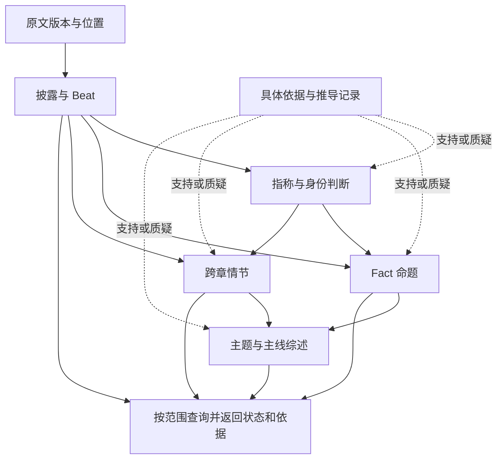

# V7 小说记忆模型：可修正的整书认识

状态：**reviewing，2026-09-09**。开发者已授权完整设计并要求文档完成后审查；本文的推荐方案尚未获开发者接受，不是产品 Spec，不证明 V7 已实现。正文中的“必须”描述本候选方案内部约束。

开发者随后指出缺少具体 schema、实体摘要查询优化及实际金标，授权使用样书前两章检验并调整模型。当前补充入口为 [schema 与投影](novel-memory-v7/schema-and-projections.md)、[前两章金标 Task](../../.agents/works/w00005-novel-understanding-spike/tasks/t07-v7-schema-gold/README.md) 和 [V7 查看器 Task](../../.agents/works/w00005-novel-understanding-spike/tasks/t08-v7-memory-viewer/README.md)。具体数据结构和离线验证属于提案实验，不能等同于生产整理管线已经实现。

## 1. 问题与目标

系统要为整本小说维护可查询的语义知识和情节知识，让使用系统的 Agent 能利用已有整理回答问题。Agent 负责理解问题、选择查询、判断是否深入原文和组织答案；系统负责跨章身份、关系、情节及推断的积累与修正。

[V7 需求基线](../../.agents/works/w00005-novel-understanding-spike/tasks/t05-v7-requirements/requirements.md) 保存已确认需求及八个原始问题。本文提出满足这些需求的完整设计，不重新限定 if 线资料范围，不规定八条交互工作流，不继承 V6 schema。

核心目标：

1. 同一个人物跨章拥有统一查询入口；误归并后能够拆开并修正受影响认识。
2. 人物关系、设定与规则形成有依据的 Fact，图中知识足够时直接回答。
3. 相识、冲突、成长等过程形成跨章情节，支持过程查询与不同尺度的剧情概括。
4. 允许 Fact、披露、情节参与推断；前提变化后局部重审，不靠禁止推断回避风险。
5. 全书信息、故事时点和角色认知分别限定；后文揭晓可解释过去，原作未来不成为 if 线必然。
6. 数据、判断、修正与处理覆盖范围可审查，缺失和不确定性可被调用者识别。

非目标：完整模拟虚构世界、自动写 if 线正文、替作者裁定世界真相、穷举所有句子的全部命题、提供通用逻辑定理证明器、本轮替换 nb-memory、接入 MCP 或实现生产服务。

## 2. 阅读路径与正文分工

本文是一份提案，由以下正文共同组成；附录不单独生效。

| 文档 | 负责回答 |
| --- | --- |
| [知识模型](novel-memory-v7/knowledge-model.md) | 记住什么；身份、Fact、披露、Beat、情节、依据和时间如何连接 |
| [维护与查询](novel-memory-v7/maintenance-and-query.md) | 如何形成和修正；ingest、梦境、发布、查询、故障恢复怎样落地 |
| [场景与验收](novel-memory-v7/scenarios-and-validation.md) | 真实小说怎样进入模型；反例怎样处理；如何证明有用 |
| [具体 schema 与查询投影](novel-memory-v7/schema-and-projections.md) | 严格数据结构、实体摘要、索引和实际验证边界 |

建议先读本文，再按表中顺序阅读正文。[设计 Task](../../.agents/works/w00005-novel-understanding-spike/tasks/t06-v7-model-design/README.md) 与其 walkthrough 只保存执行和审查记录。

## 3. 方案概要

V7 保存文本材料、整理后的认识以及形成认识的依据。来源材料不会被整理结论覆盖；抽取和整理都可能出错，因而都保留版本与替代关系。

箭头表示内容来源和查询路径，不是要求严格一次通过的流水线。身份与知识之间的改进通过后续版本进行；每次已发布判断的具体依据必须无循环。

### 3.1 建议采用的关键取舍

| 决定 | 对使用者的影响 | 代价与替代方案 |
| --- | --- | --- |
| Fact 是完整命题；其支持程度另行评估 | 可直接查关系，同时看出角色说法、系统推断和争议 | 比只存披露复杂；纯披露方案把跨章理解重复交给查询 Agent |
| 稳定指称记录与可修正身份判断分离 | 查询可统一身份，拆分仍可恢复材料归属 | 需要映射版本及依赖；破坏性合并更简单但难纠错 |
| Beat 保留章内材料，情节跨章聚合 | 既能检索小片段，也能解释发展过程 | 聚合是语义判断；按章节机械串联不能处理回述 |
| 依据钉住具体版本，重审关注范围独立保存 | 可解释“当时为何这么判断”，新材料仍会触发回访 | 不能只把一个动态查询当成证据 |
| 时间采用有依据的局部约束和显式未知 | 不编造起止点，仍能利用后文理解过去 | 部分时点查询会返回不确定项，不承诺完整状态快照 |
| 推断可连续进行，重复来源不增加独立支持 | 梦境能形成新知识且可撤回 | 需要依赖图、反证处理和发布评估；不做置信度乘法或多数投票 |
| 语义整理增量运行，梦境做受限的跨区域回访 | 新章后已有可用知识，后台仍能逐步改善 | 要暴露整理滞后，不能只标记“入库成功” |
| 先采用本地单写入者、版本记录与可重建索引 | 数据可导出、恢复；不需先部署图数据库 | 写入提交串行；吞吐和实际成本待实验 |

### 3.2 认识论边界

有依据不等于绝对正确。系统可以接受“这两人已经交上朋友”作为当前认识，而保留其依据和适用范围。事实未确定时保留候选或争议；来源为叙述者也不消除这种可修正性。

开放世界是默认前提：“当前未找到”不能转换为“原作不存在”。集合查询能够穷尽当前已整理记录，但只有文本明确提供的封闭集合才能支持“原作只有这些成员”。

## 4. 历史设计与实际证据

| 来源 | 保留 | 不继承 |
| --- | --- | --- |
| [初版](../../.agents/works/w00005-novel-understanding-spike/tasks/t02-novel-memory-model-design/memory-model.md) | 语义与情节并存、Fact 推导依据 | 单值谓词自动覆盖、中心性决定真伪、预置大量类型和评分 |
| [V3](../../.agents/works/w00005-novel-understanding-spike/tasks/t02-novel-memory-model-design/memory-model-v3.md) | 来源与世界真相分离、时间表达也可能不可靠 | 因无法知道完整世界而只积累披露；事务顺序代替阅读位置 |
| [V4](../../.agents/works/w00005-novel-understanding-spike/tasks/t02-novel-memory-model-design/memory-model-v4.md) | 主体导航、Beat 与场的尺度区分、离线整理 | Fact 等于槽、动态槽作为唯一推断依据、禁止推断支持推断 |
| [V5](../../.agents/works/w00005-novel-understanding-spike/tasks/t02-novel-memory-model-design/memory-model-v5.md) | 命题与表述分开、局部支持不能扩张到整个合取 | 类型 DSL 先行、Fact 内容哈希承担语义同一性、字段体系成为内容准入门槛 |
| [V6](../../.agents/works/w00005-novel-understanding-spike/tasks/t02-novel-memory-model-design/memory-model-v6.md) | 原文定位、开放披露、真实小规模实验 | about 共现冒充语义关系、强制原文路径、只靠章级输出形成全书认识 |

V6 的数量统计以需求基线第 7 节为准。本次额外核对真实数据：第 8 章末递纸条，第 9 章交友与互报姓名，第 10 章同行和吃饭；第 9 章首个 Beat 的区间只有 1–3 段，gist 却包含第 4 段“手足无措”。这说明抽取材料也需要纠错，不能把“披露只增不改”理解为旧提取永远有效。定位和预期处理见场景正文。

这些是对 V6 的局部只读观察，未完成 V6 全面语义审计。后续前两章金标从 EPUB 正文独立标注，使用新的规范化版本；V6 的旧段号不直接套入新金标。实验能验证具体结构与查询行为，自动抽取质量仍未验证。

## 5. 能力边界与工程方向

下列是候选能力边界，不是新增 workspace 包清单：

| 候选 capability | 数据与职责 | 依赖 |
| --- | --- | --- |
| `novel-memory.materials` | 原文版本、位置、提取材料和局部指称 | 无 |
| `novel-memory.knowledge` | 身份判断、Fact、情节、综述、依据和评估 | materials |
| `novel-memory.maintenance` | 任务调度、候选变更、依赖失效、原子发布与恢复 | materials、knowledge |
| `novel-memory.query` | 范围求值、身份导航、集合、检索和证据访问 | materials、knowledge 的已发布视图 |

查询不依赖正在运行的整理任务；它读取已发布的覆盖与滞后信息。调度使用查询式召回时，经注入的只读数据访问口完成，不让领域模型依赖 MCP 或 Agent 对话流程。

首轮建议独立 spike 的 SQLite 存储适配器、确定性索引和宿主任务队列；领域记录不绑定 SQL 表名。现有 nb-memory 的发生事实、状态与 tick 语义不等于本模型，不做兼容包装。现有 nb-workflow 可评估用来组织 Activity，但其内存 backend 不承担持久任务、租约和外部调用幂等。依据与限制见维护正文。

## 6. 数据、接口、安全、迁移与回滚影响

- 原文以作品及版本隔离，历史位置不能自动解释为最新正文位置；if 线正文属于另一个分支资料范围，不写回原作认识。
- 公开查询返回版本、状态、范围和可继续展开的依据。本文规定语义，不冻结 MCP 名称、参数 JSON 或远程协议。
- 小说正文和提取内容作为数据处理；其中的工具指令不构成执行授权。Provider 密钥、会话凭据不进入命题、证据或导出。
- V6 数据只作为只读导入候选；必须保留旧 ID 和来源，重新检查其证据范围及身份判断，不直接升级为已接受 V7 知识。
- 不原地迁移产品 nb-memory，不向 World Engine 写入“真实状态”。接入产品、数据保留策略及真实模型调用分别由后续实施范围决定。
- 每批知识变更有前置版本和原子提交；错误发布以新修正版本恢复逻辑结果，不删除历史。物理删除、历史保留期与多机同步不在本轮合同。

## 7. 验证与进入实施的条件

当前按开发者追加要求，先使用 EPUB 前两章制作可审查金标并运行通用查看器，检验 schema、身份、摘要及证据查询。第 8–10 章推演与 60 项反例矩阵保留为后续长文本和修正流程验收；它们不是已通过的测试清单。

本提案选择推荐方案，以下仍是实际风险而非遗漏的产品规则：

- LLM 对身份、谓词等价、动机和事件聚合的判断可能不稳定，结构检查不能证明它们正确。
- 规则的条件与例外采用有限结构，复杂内容需要文本和推断辅助，不能保证任意逻辑查询。
- 持续增量整理可能遗留跨区域遗漏；周期覆盖审计降低风险但不证明全书穷尽。
- 历史范围和身份拆分需要精确依赖，成本可能超过仅保存当前图；首轮通过量测决定缓存策略。

开发者已授权本地 schema、金标和查看器实验；生产接入仍待接受后按能力边界登记 planned Spec。具体序列化 schema 以补充正文链接的可执行定义为准。正式数据库 DDL、远程工具协议、模型选型及生产性能目标仍由后续实施决定。

## 8. 决策记录

| 日期 | 决策者 | 结论 |
| --- | --- | --- |
| 2026-09-09 | 开发者 | 授权直接完成 V7 模型设计、反复推敲并落盘，完成后由开发者审查 |
| 2026-09-09 | Leader | 提交本文及三个正文作为推荐方案；状态 reviewing，不代替开发者接受 |
| 2026-09-09 | 开发者 | 要求补充具体 schema、V4 所述实体 summary 查询优化、前两章金标及通用查看器；允许依据实际抽取修订模型 |
